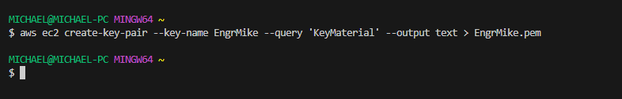
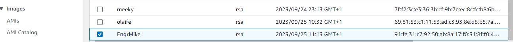
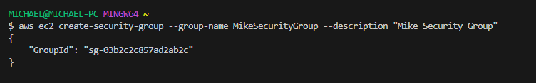
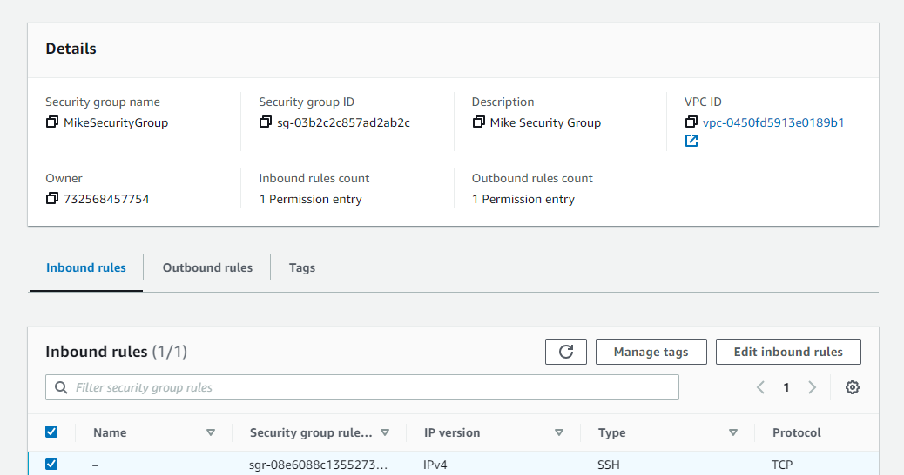
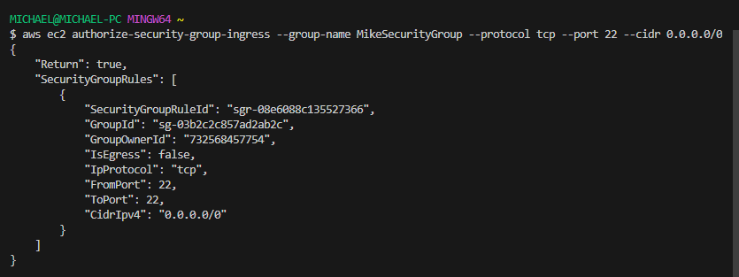
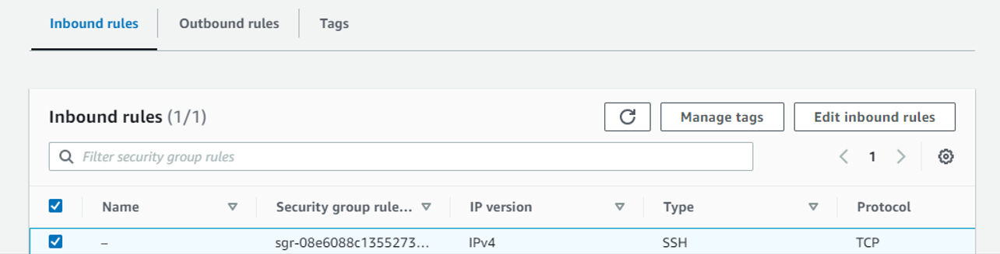
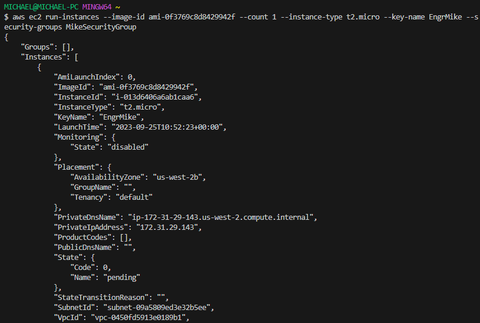
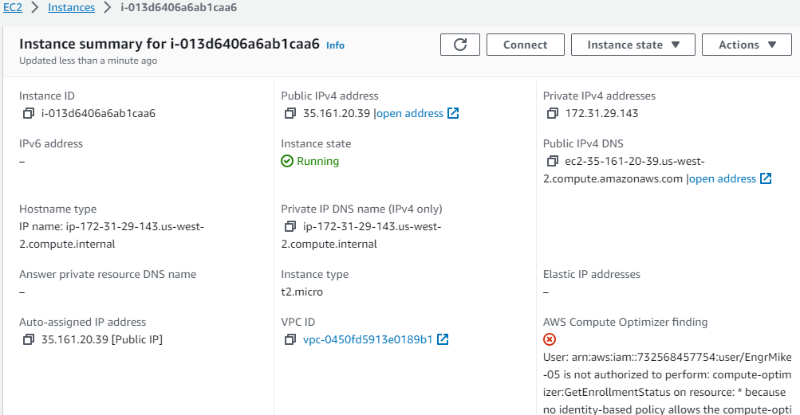
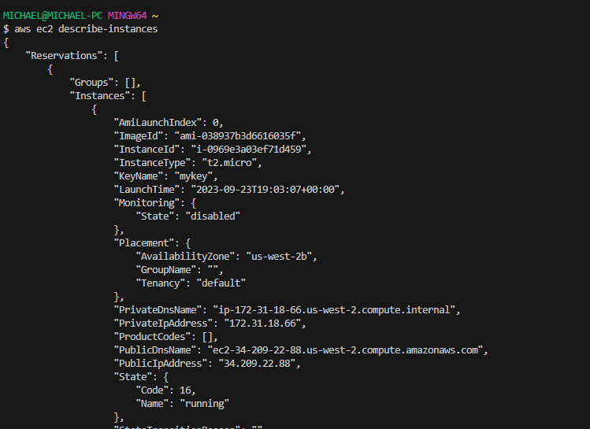
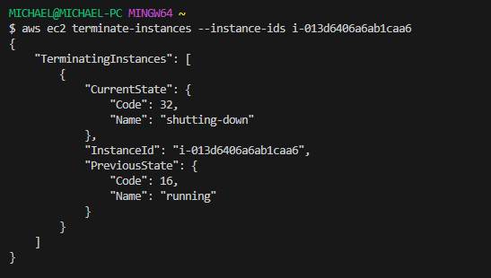

# Launching an Ec2 Instance using CLI

## Installing AWS CLI
### Run the 'apt update' command to update if aws cli is already installed and 'apt install awscli -y' command to install.
```bash
apt update
```
```bash
apt install awscli -y
```

## Configure AWS CLI
### input 'aws --version' to confirm version installed and 'aws configure' to configure aws cli
```bash
aws --version
```
```bash
aws configure
```

## log in to cli using access key
## create key pair
```bash
aws ec2 create-key-pair --key-name mykeypair --query 'KeyMaterial' --output text > mykeypair.pem
```

### GUI


## create own security group
```bash
aws ec2 create-security-group --group-name MySecurityGroup --description "My Security Group"
```

### GUI


## Allow ssh
``` bash
aws ec2 authorize-security-group-ingress --group-name MySecurityGroup --protocol tcp --port22 --cidr 0.0.0.0/0
```

### GUI


## Launch Ec2
```bash
aws ec2 run-instances --image-id ami-id --count 1 --instance-type t2.micro --key-name mykeypair --security-groups MySecurityGroup
```

### GUI


## Describe Instance
```bash
aws ec2 describe-instances
```


##  Terminate Instances
``` bash
aws ec2 terminate-instances --instance-ids my-instance-id
```

### GUI


## Conclusion

You have successfully launched an EC2 instance on AWS using the AWS CLI. Make sure to monitor and manage your instances as needed, and always follow best practices for security and cost optimization.

For more information on AWS EC2 and its features, refer to the [AWS EC2 documentation](https://docs.aws.amazon.com/ec2/).

---

